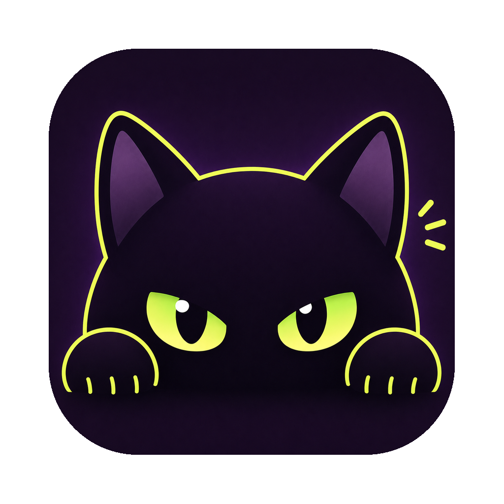

# Kurotty

<p align="center">
  
</p>

Kurotty is a macOS-first terminal emulator built with Swift/AppKit, Zig, and Metal.

Kurotty is currently an early developer build. Public packaged releases are not available yet.

[Download](#download) · [Features](#features) · [Build From Source](#build-from-source) · [License](#license)

## Download

Kurotty is intended to ship as a prebuilt macOS app so normal users do not need to clone the repository or install build tools.

When the first public release is available, download the latest `.dmg` or `.zip` from [GitHub Releases](https://github.com/skyepodium/kurotty/releases), verify the checksum, and move `kurotty.app` to `/Applications`.

```sh
shasum -a 256 -c SHA256SUMS
```

Planned release assets:

- signed universal macOS app for Apple Silicon and Intel Macs
- `.dmg` or `.zip` download
- `SHA256SUMS` checksum file

## Features

- Native macOS tabs, split panes, menus, keyboard input, IME, clipboard, and preferences.
- Metal rendering for glyphs, backgrounds, cursor, underline, and strikethrough.
- Theme presets, scrollback, and editable JSON settings.
- Terminal styling support for 16-color, 256-color, truecolor, dim, inverse, underline, and strikethrough.
- OSC title, working-directory, color query, and iTerm2-compatible notifications.

Notification example:

```sh
printf '\e]9;Task finished\a'
```

Kurotty shows OSC 9 messages as macOS `Alert` notifications with the app icon and the message body.

## Build From Source

This path is for contributors and local testing until packaged releases are available.

Requirements:

- macOS 14 or newer
- Xcode command line tools
- Swift 6 toolchain
- Zig

```sh
git clone https://github.com/skyepodium/kurotty.git
cd kurotty
zig build
swift run kurotty
```

To install a local app bundle:

```sh
./scripts/install-app.sh
open /Applications/kurotty.app
```

Developer notes live in `docs/`.

## License

Kurotty is released under the MIT License.
