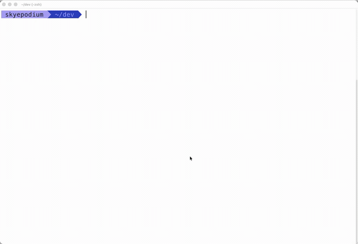

# Kurotty

<p align="center">
  
</p>

<p align="center">
  
</p>

Kurotty is a macOS-first terminal emulator built with Swift/AppKit, Zig, and Metal.

Kurotty is currently an early developer build. Download the latest alpha release if you only want to try the app; build from source if you want to contribute.

[Download](#download) · [Features](#features) · [Build From Source](#build-from-source) · [License](#license)

## Download

Kurotty ships as a notarized Universal DMG for Intel and Apple Silicon Macs.

[Download the latest Kurotty DMG](https://github.com/skyepodium/kurotty/releases/latest/download/kurotty-macos-universal.dmg)

Open the DMG, drag `kurotty.app` to `Applications`, then launch it from `/Applications`.

Shell download:

```sh
curl -fL -o kurotty-macos-universal.dmg \
  https://github.com/skyepodium/kurotty/releases/latest/download/kurotty-macos-universal.dmg
open kurotty-macos-universal.dmg
```

Release notes, checksums, and older builds are available on [GitHub Releases](https://github.com/skyepodium/kurotty/releases). On first launch, macOS may ask for notification permission because Kurotty supports terminal-triggered task notifications.

## Features

- Native macOS tabs, split panes, menus, keyboard input, IME, clipboard, and preferences.
- Metal rendering for glyphs, backgrounds, cursor, underline, and strikethrough.
- Theme presets, scrollback, and editable JSON settings.
- Terminal styling support for 16-color, 256-color, truecolor, dim, inverse, underline, and strikethrough.
- OSC title, working-directory, color query, and iTerm2-compatible notifications.

Kurotty shows OSC 9 messages as macOS `Alert` notifications with the app icon and the message body.

## Build From Source

This path is for contributors and local testing.

Requirements:

- macOS 14 or newer
- Xcode command line tools
- Swift 6 toolchain
- Zig

```sh
git clone https://github.com/skyepodium/kurotty.git
cd kurotty
zig build
swift run kurotty
```

To install a local app bundle:

```sh
./scripts/install-app.sh
open /Applications/kurotty.app
```

To create a local Universal DMG:

```sh
./scripts/package-release.sh
```

Developer notes live in `docs/`.

## License

Kurotty is released under the MIT License.
