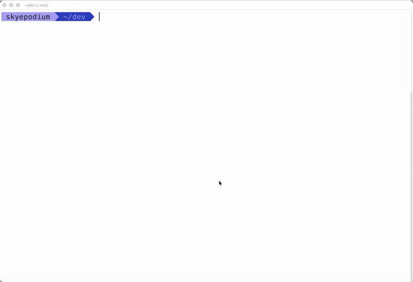

# Kurotty

<p align="center">
  
</p>

<p align="center">
  
</p>

Kurotty is a macOS-first terminal emulator built with Swift/AppKit, Zig, and Metal, with first-class support for running AI coding agents such as Claude Code and Codex.

Kurotty is currently an early developer build. Download the latest alpha release if you only want to try the app; build from source if you want to contribute.

[Download](#download) · [Features](#features) · [Working With Coding Agents](#working-with-coding-agents) · [Architecture](docs/architecture.md) · [Build From Source](#build-from-source) · [License](#license)

## Download

Kurotty ships as a notarized Universal DMG for Intel and Apple Silicon Macs.

[Download the latest Kurotty DMG](https://github.com/skyepodium/kurotty/releases/latest/download/kurotty-macos-universal.dmg)

Open the DMG, drag `kurotty.app` to `Applications`, then launch it from `/Applications`.

Shell download:

```sh
curl -fL -o kurotty-macos-universal.dmg \
  https://github.com/skyepodium/kurotty/releases/latest/download/kurotty-macos-universal.dmg
open kurotty-macos-universal.dmg
```

Release notes, checksums, and older builds are available on [GitHub Releases](https://github.com/skyepodium/kurotty/releases). On first launch, macOS may ask for notification permission because Kurotty supports terminal-triggered task notifications.

## Features

- Native macOS tabs, split panes, menus, keyboard input, IME, clipboard, and preferences.
- Metal rendering for glyphs, backgrounds, cursor, underline, and strikethrough.
- Theme presets, scrollback, and editable JSON settings.
- Terminal styling support for 16-color, 256-color, truecolor, dim, inverse, underline, and strikethrough.
- OSC title, working-directory, color query, and terminal-generated notifications.
- Local tmux control-mode integration: `tmux -CC` windows become native tabs and panes become native splits.
- Sidebar panels for command history, the file explorer, and stored coding-agent sessions, plus a Command Palette and a status bar.
- A menu bar extra carrying Kurotty's own mark, with rows to open the app, open Settings, check for updates, and quit. On by default; `terminal.menuBarExtraEnabled` turns it off and hands the slot straight back to macOS.
- First-class support for working alongside Claude Code and Codex: live agent status, a session vault, token, context, and rate-limit accounting, per-file change provenance, and git worktree awareness. See [Working With Coding Agents](#working-with-coding-agents).

### tmux

Run `tmux -CC` or `tmux -CC attach` in a local Kurotty shell to enter native tmux mode. Kurotty keeps ordinary `tmux` in its standard terminal UI and supports multiple simultaneous local control-mode sessions, including clients launched from different panes of the same split tab. It reconstructs each pane's screen, cursor, alternate screen, and terminal modes on attach, then mirrors window order, pane titles, layout, focus, zoom, output, and native resizing. Pane replay and pending mutations are bounded, new panes are captured before live output is shown, and the exact original shell pane or tab is restored after detach or a control-client transport failure. Advanced swap, rotate, zoom, layout, and detach commands are available from the Command Palette while a control-mode session is active. SSH and remote tmux control connections are intentionally outside this local integration.

### Notifications and shell integration

Kurotty normalizes OSC 9, OSC 777 `notify;title;body`, and rich iTerm2 OSC 1337 notifications into one typed notification path before showing macOS notifications. Terminal BEL rings the bell and, while Kurotty is unfocused, shows the payload-free fallback `Kurotty` / `Check your terminal.` Numeric OSC 9 progress extensions are not treated as desktop alerts; `OSC 9;4;<state>;<percent>` is parsed as progress data and drives the pane's progress bar instead. No source is selected by a CLI name or by scraping rendered terminal text.

While a command runs, the pane whose shell is running it shows a 2px progress bar across its own top edge — per pane, so one busy split never implies the whole window is busy. It appears only once the command has run past a short threshold, sweeps while nothing has said how far along it is, and shows a real percentage when a program reports one over OSC 9;4. Every boundary comes from OSC 133, never from output volume or a quiet timer. Reduced motion replaces the sweep with a static bar rather than removing the status, and `terminal.commandProgressIndicatorEnabled` turns the whole thing off.

For ordinary shell commands, Kurotty automatically loads bundled zsh, bash, or fish integration and consumes standard OSC 133 command boundaries. This reports completion from command metadata such as exit status and duration for any program. The integration is resolved from the running app's resource bundle, preserves the user's shell environment, and does not modify dotfiles or store a username, home directory, checkout path, or `/Applications` path. Unsupported shells continue without injection and may emit OSC 7/133 themselves.

Long-running interactive programs do not return control to the shell after each internal task. Exact task content therefore requires an explicit OSC 9/777/1337 or bridge payload. BEL carries only an attention signal—not a title, response, success state, or completion meaning—so Kurotty does not guess those fields from an application name or screen wording.

Kurotty also implements xterm focus reporting (`CSI ? 1004 h/l` with `CSI I/O` responses). Interactive programs can therefore apply their own standard unfocused-notification policy without Kurotty-specific detection.

Programs launched inside Kurotty may also use its producer-neutral bridge without knowing an installation path:

```sh
$KUROTTY_NOTIFY_COMMAND --notify "Build finished"
$KUROTTY_NOTIFY_COMMAND --notify-json '{"version":1,"event":"task.completed","session_id":"pane-42","duration_ms":2600,"title":"Build finished","body":"Tests passed."}'
```

The JSON contract is producer-neutral. `body` (or the legacy aliases `message`, `text`, and `summary`) contains the user-visible work result; `title` and `subtitle` are optional. Version 1 also preserves optional `event`, `session_id`, and `duration_ms` metadata. The command sends only to a live KuroTTY bridge, so a KuroTTY helper invocation cannot accidentally publish another application's desktop notification.

Explicit OSC 9/777/1337 and bridge events preserve producer-supplied content. When a producer emits only BEL, Kurotty can show only the fixed `Check your terminal.` fallback; it never reconstructs a response from submitted input, rendered cells, output volume, or a quiet timer. OSC 0 window titles and their BEL terminators remain title protocol, not task notifications.

Kurotty exports `KUROTTY_NOTIFY_SOCKET` and `KUROTTY_NOTIFY_COMMAND` from the running bundle for every child shell. Nothing on this path edits another program's configuration or assumes `/Applications`, a username, a checkout path, or a particular producer. The only place Kurotty writes to a file it does not own is the agent hook installer described below, which covers Claude Code and Codex, asks once per agent before its first write, and is reversible.

## Working With Coding Agents

Kurotty treats Claude Code and Codex as first-class tenants of a pane. Everything in this section is either observation of files those agents already wrote to disk, or an explicit protocol a producer opts into. Nothing here reads rendered terminal text, and no surface described below runs a command for you: commands are inserted at the prompt and you press Return.

Two settings gate this, both under Preferences and both mirrored in the JSON settings file. `terminal.agentSessionIndexEnabled` defaults to on and controls reading agent transcripts. `terminal.agentStatusHooksEnabled` defaults to on and controls the hook path, but the setting alone never edits anything: the first write into each agent's own configuration waits for a one-time prompt naming that exact file, recorded per agent in `terminal.agentStatusHookConsent` (Claude Code) and `terminal.agentStatusCodexHookConsent` (Codex).

### Agent status in the pane header and status bar

A pane header shows a colored dot for the agent running in it, with a rotating arc while the agent is working. The status bar carries one segment for the whole window rather than one per agent: the highest-priority state wins — blocked, then waiting, then working, then done — with a count when more than one agent is reporting. There are exactly four states — `working`, `waiting`, `blocked`, `done` — and Kurotty accepts them from two inputs and nowhere else. It never infers agent state from a window title, a process name, rendered rows, or output volume.

The first input is an OSC sequence, always on and requiring no setting:

```sh
printf '\033]9999;{"state":"working","agent":"claude","detail":"running tests"}\007'
```

`ESC \` is accepted as a terminator alongside BEL. `state` is required and must be one of the four values; an unknown value is ignored rather than guessed at. `agent` and `detail` are optional display metadata, capped at 40 and 200 characters. The sequence is always stripped from the visible stream, including when it is malformed, oversized, or carries an unknown state, and a sequence split across PTY reads is reassembled through a bounded 4 KB buffer that discards to the next terminator on overflow. What this does not include is a producer. Kurotty ships nothing that emits the sequence, and neither agent emits it on its own, so this channel is one you wire up from a wrapper script or from any program willing to adopt it. In exchange it is the one status path that survives a hop: the sequence is ordinary bytes in the pane's output stream, so it works for an agent running over SSH or inside a container, where the hook below cannot reach.

The second input is a loopback HTTP endpoint, which runs only once an agent's hooks are actually installed. When enabled, Kurotty binds a listener on `127.0.0.1` on an OS-assigned port and generates a fresh 256-bit token per launch. A post must carry that exact token in `X-Kurotty-Hook-Token`, compared byte by byte in constant time; anything else is answered `401` and dropped. Requests are capped at 8 KB and bodies at 4 KB. The body is parsed as data only: no field is executed, interpolated into a command, or written to disk, and the token and payload are never logged. The listener is not reachable off-host, so this path covers local panes only.

Every state carries a maximum age — 5 minutes for `working`, 30 minutes for `waiting` and `blocked`, 10 minutes for `done`. Past that the status is cleared rather than downgraded, so an agent that was killed, suspended, or disconnected without ever reporting a terminal state cannot leave a stuck spinner behind.

### The agent hook installer (Claude Code and Codex)

Turning on `terminal.agentStatusHooksEnabled` writes hook entries into each agent's own configuration so status works without the agent knowing anything about OSC 9999. **These two agents are the whole list.** Any other agent in a pane reports status only over OSC 9999, and shows nothing at all if it does not emit it.

| Agent | File | Events written | States reported |
| --- | --- | --- | --- |
| Claude Code | `~/.claude/settings.json` | `UserPromptSubmit`, `Notification`, `Stop` | `working`, `waiting`, `done` |
| Codex | `~/.codex/hooks.json` | `UserPromptSubmit`, `Stop` | `working`, `done` |

Codex emits nothing that honestly means "the agent is waiting for you". Its `PreToolUse` fires for every tool call whether or not approval is required, so reading it as `waiting` would report a state the agent is usually not in; Kurotty leaves `waiting` unreported for Codex rather than approximating it. `blocked` has no lifecycle event in either agent. Both states still arrive over OSC 9999 from a producer that sends them.

Codex is only touched when `~/.codex` already exists. Kurotty does not create a configuration directory for a program you may not have installed, and does not raise a prompt about one.

The installer is deliberately narrow about files it does not own:

- Nothing is written until you say yes. The prompt names the exact file, and the answer is recorded per agent — a yes about Claude Code's settings is not a yes about Codex's hooks. Refusing every agent turns the setting back off, so the checkbox is never a switch that does nothing.
- No tool-use hook is installed, so no prompt, tool argument, or file path is observed through this path.
- The agent's hook stdin payload is ignored and never forwarded. The generated command posts a fixed JSON body assembled from environment variables Kurotty injected into the PTY, so nothing from inside the conversation leaves the agent.
- Every entry Kurotty writes carries the marker `kurotty-agent-status-hook`. Uninstall removes only entries carrying that marker and prunes the empty containers left behind, so it cannot eat a hook you wrote — including one written by third-party tooling such as `oh-my-codex`, which commonly owns `~/.codex/hooks.json`.
- The existing file is copied to `<name>.kurotty-backup` before any write, and every other key is preserved.
- A configuration Kurotty cannot fully recognize is reported and left byte-identical: unreadable, not JSON, not a JSON object, or — for Codex, whose schema accepts only `description` and `hooks` at the top level — carrying a key Codex itself would reject. Kurotty neither repairs such a file nor writes through it, because someone else's hooks are not Kurotty's to lose. That refusal covers uninstall too, so entries can be left behind by it; they are inert everywhere outside Kurotty.
- The command is inert in any other terminal: it exits 0 when `KUROTTY_HOOK_PORT` and `KUROTTY_PANE_ID` are absent. It shells out to `/usr/bin/curl` with a 2-second timeout.
- Turning the setting back off stops the listener and removes the entries from every agent.

Failures are reported, never fatal: an unreadable configuration file, one that is not a JSON object, one whose shape Kurotty declines to rewrite, or a listener that cannot bind leaves hooks unavailable and the rest of the app untouched.

### The session vault

`⌘⇧A`, or the Command Palette, opens a sidebar listing agent sessions that are already stored on this Mac: Claude Code's `~/.claude/projects/<project>/<sessionId>.jsonl` and Codex's `~/.codex/sessions/**/rollout-*.jsonl`. This is read-only. Kurotty never copies transcript content into its own storage; the index holds metadata in memory for the life of the process, and turning the setting off drops it immediately.

Sessions group by project, by parent folder, or by agent, and the filter matches each typed token as a substring or as an in-order subsequence, so `krt` finds `kurotty`. Selecting a row, pressing Return, or double-clicking inserts the resume command at the active prompt — `cd '<cwd>' && claude --resume <id>`, or `codex resume <id>` for Codex — with no trailing newline. The panel has no execute path at all; every other action is copy or reveal. A transcript can also be opened in a read-only viewer in a center tab, which tail-follows the file, expands tool calls in place, retains at most 4,000 messages, and says so when it is holding older records back. That viewer has no composer, no send button, and no PTY handle.

The bounds are worth knowing, because they are visible in the numbers:

- At most 4,000 transcript files are walked and the 500 most recently updated sessions are kept.
- A transcript over 64 MB is skipped entirely. Above 512 KB, only a 128 KB head window and a 128 KB tail window are parsed — every field the list needs is at one end or the other — and those rows show their message count as a lower bound with a trailing `+` rather than claiming a total they did not observe.
- Claude Code records a git branch and Codex does not, so the branch is simply absent for Codex rows. Titles come from Claude's own session title when it wrote one, and otherwise from the first line of the first user prompt that is not an injected context block.

### Token usage and context forecast

Token counts come from the transcripts the index already scanned. There is no API call, no network request, and no account to connect: the numbers are whatever the agent itself wrote to disk. The two agents report in opposite shapes and Kurotty keeps them apart — Claude writes a fresh usage block per assistant message, which are summed, while Codex writes a running total per `token_count` event, where the last one supersedes the previous.

The context meter answers "how much room is left in this session", and each half of that sentence is sourced differently:

- Occupancy is measured. It is the most recent request's prompt plus its reply, not the session total, because re-sending the conversation every turn makes a cumulative count pass the window long before the window is actually full.
- The window is measured for Codex, which records `model_context_window` beside every token event. For Claude, which records no window anywhere, it is resolved from the model id through a small table of models whose published window is known. A model that is not in that table has no window, and the meter is hidden rather than drawn against a plausible-looking guess: a wrong limit produces a wrong "room left", which is worse than no answer.
- "About N turns left" is an estimate and is marked as one. It appears only when at least five growth steps were observed, and uses the median rather than the mean, because a bounded head/tail read contributes one enormous bogus step at the seam and a compacted session contributes negative ones. A turn here is one model request, not one thing you typed: a single prompt that runs a dozen tools spends a dozen of them.

The usage strip above the session list shows a token total for today and a bar per day over a trailing window. It credits a whole session to the day it was last updated, which is coarse on purpose: attributing a long session across midnight would mean re-reading every transcript to move a bar by a few percent.

### Rate-limit quota

Above that strip, a quota section answers a different question: not what you spent, but how much of your plan's allowance is gone and when it comes back. Each live window gets a meter — `Codex 5h · Resets in 4h 12m` over a filled track — and the fullest window across every agent is condensed into the bottom status bar, where clicking it opens the same meters.

The same rule as everywhere else in this feature applies: the numbers are whatever the agent wrote to disk, and nothing else. Codex records `rate_limits` beside every token event, so its quota costs no extra work — it comes off lines Kurotty was already reading. **Claude Code records no rate-limit information anywhere on disk.** Those numbers live behind your Claude account's OAuth credentials, and Kurotty does not read your credentials and does not contact Anthropic on your behalf, so a Claude row reports "does not record rate limits on disk" rather than a guess. That is a deliberate limitation, not an oversight: reading another application's stored token to make a network call is a different kind of program than the local, read-only one Kurotty's agent surfaces are.

A window is named by the duration the agent reported — `5h`, `7d` — rather than sorted into a fixed set of buckets, so a plan whose windows Kurotty has never seen still gets an exact label. Readings whose reset has already passed are dropped rather than shown, because most stored transcripts describe a window that rolled over long ago.

### Which files the agent changed

Both agents already record their writes, and the transcript preserves the order of user prompts against them. Kurotty joins the two: the file explorer marks a file — and every folder above it, so a collapsed folder still shows that something inside moved — when an indexed session wrote it within the last 24 hours, and the tooltip names the agent, how long ago, and the line of the prompt that preceded the write.

Claude writes are read from `Edit`, `Write`, `MultiEdit`, and `NotebookEdit` tool calls carrying an absolute path; a call whose result came back an error never touched the file and is dropped. Codex has no edit tool, so writes are read from the `patch_apply_end` event that reports `success`, with `add`, `update`, and `delete` per path. Only paths and timestamps are kept — the old and new strings and the unified diff the transcript carries are read and discarded.

Two real limits, both consequences of the bounded read above. Writes in the middle of a very large transcript are never seen, so a file can go unmarked. And a write that lands just past the seam between the head and tail windows can be labeled with the last prompt from the head window rather than the prompt that actually caused it; the agent and the session are still correct, but that one prompt line can be stale. The index keeps the 20,000 newest writes overall and 20 per file, dropping oldest history first, so a file never loses its most recent change.

### Git worktrees

When the active pane's working directory is inside a git repository, the status bar carries a worktree segment built from `git worktree list --porcelain`. The containing worktree is resolved by git itself through `rev-parse --show-toplevel`, not by matching path strings, so a linked worktree reports itself rather than the main checkout. Each popover row shows the branch — or a short SHA when the head is detached, or the directory name when there is neither — a `*` when the checkout has uncommitted changes, and how many indexed agent sessions have their working directory inside it. Sessions are attributed to exactly one worktree, the deepest one containing them, so a linked worktree nested inside the main checkout is not counted twice. Clicking a row inserts `cd '<path>'` at the prompt, again without a newline. Ignored files are not requested, so a build directory cannot make every worktree look dirty, and the dirty check is capped at 12 checkouts per refresh so one status update cannot fan out into dozens of processes.

## Build From Source

This path is for contributors and local testing.

Requirements:

- macOS 14 or newer
- Xcode command line tools
- Swift 6 toolchain
- Zig

```sh
git clone https://github.com/skyepodium/kurotty.git
cd kurotty
zig build
swift run kurotty
```

To install a local app bundle:

```sh
./scripts/install-app.sh
open /Applications/kurotty.app
```

To create a local Universal DMG:

```sh
./scripts/package-release.sh
```

Developer notes live in `docs/`, including the [architecture overview](docs/architecture.md).

## License

Kurotty is released under the MIT License.
