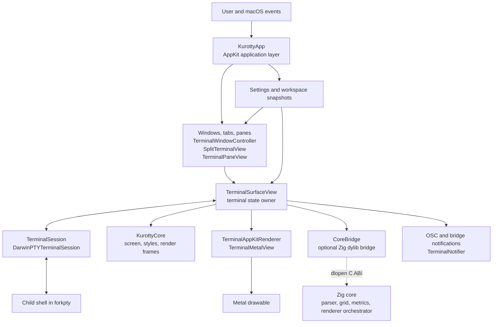
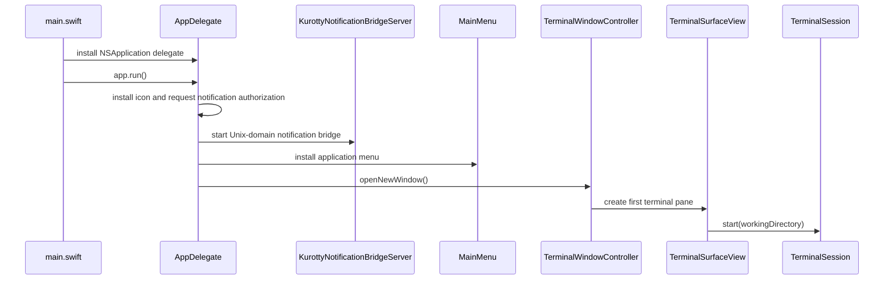
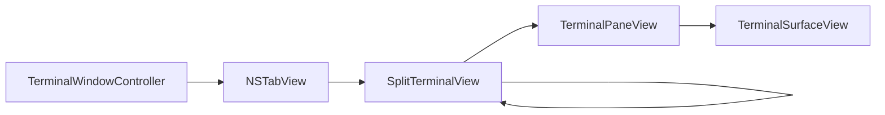
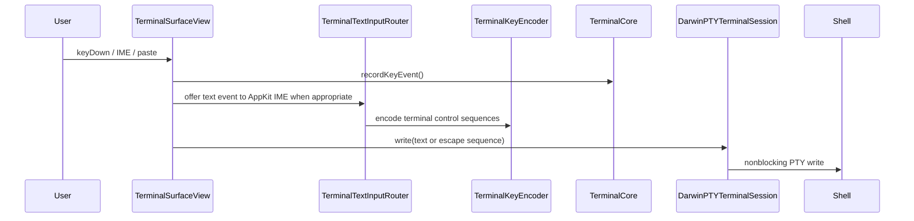
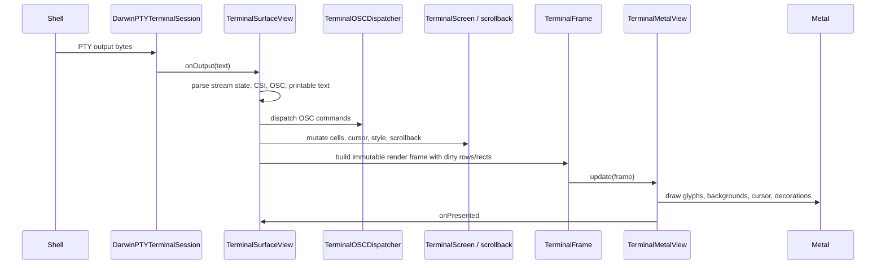
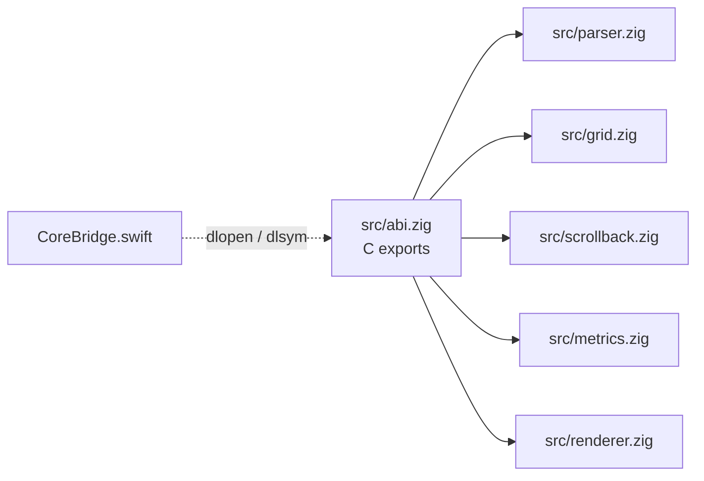
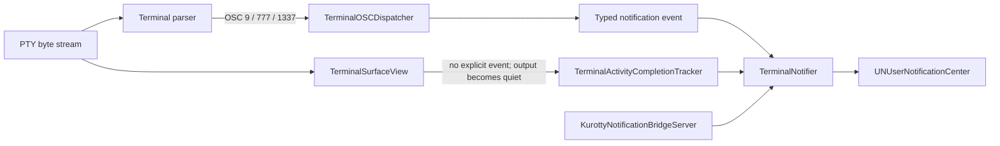

# Kurotty Architecture

Kurotty is a macOS-first terminal emulator with a Swift/AppKit application shell, a Swift terminal rendering model, a Metal renderer, and an optional Zig terminal-core dynamic library. The current production ownership is intentionally conservative: Swift owns the visible terminal state and rendering pipeline, while Zig is loaded through a narrow C ABI for incremental parser, grid, metrics, damage, and migration work.

## Repository layout

```text
Sources/KurottyApp/       macOS app, windows, panes, PTY, input, settings, notifications, Metal renderer
Sources/KurottyCore/      Shared terminal model and render-frame types used by app code and tests
src/                      Zig terminal core modules and exported C ABI
tests/KurottyRenderingTests/
                          Swift tests for rendering, settings, input, commands, OSC, snapshots, diagnostics
tests/*.zig               Zig unit and leak tests
docs/                     Developer documentation
```

`docs/` is the right home for architecture notes because the repository already uses it for developer-facing ABI documentation. The root `README.md` should stay product-oriented and link here instead of carrying implementation detail.

## Top-level components



## Runtime ownership model

The most important boundary is ownership of terminal state.

| Area | Current owner | Notes |
| --- | --- | --- |
| App lifecycle, menus, windows, tabs, panes | `KurottyApp` | `AppDelegate`, `MainMenu`, `TerminalWindowController`, and `SplitTerminalView` own AppKit composition. |
| Shell process and PTY IO | `DarwinPTYTerminalSession` | Uses `forkpty`, nonblocking master FD IO, resize ioctl, and child-process observation. |
| Visible terminal screen, scrollback, parser state, selection, cursor, IME state | `TerminalSurfaceView` | Swift currently mutates the visible model and schedules render frames. |
| Shared terminal data structures | `KurottyCore` | Provides screen cells, styles, frame types, damage metadata, and renderer protocols. |
| GPU presentation | `TerminalMetalView` | Implements `TerminalAppKitRenderer` and consumes immutable `TerminalFrame` values. |
| Zig parser/grid/metrics/damage migration path | `CoreBridge` plus `src/*.zig` | Loaded dynamically when `libkurotty_core.dylib` is present. Swift remains the mutation owner today. |
| Notifications | `TerminalOSCDispatcher`, `KurottyNotificationBridgeServer`, `TerminalNotifier` | Converts OSC or external bridge payloads into macOS notifications. |
| Settings and layout snapshots | `AppSettingsStore`, `WorkspaceSnapshotCoordinator` | Settings are normalized and live-applied where supported; workspace snapshots are currently layout-only. |

`CoreBridge` exposes diagnostics that make this ownership explicit. When the Zig library is loaded, Zig participates in feed, metrics, damage, and row-copy APIs, but Swift still owns parser mutation, screen mutation, and render mutation for the visible terminal surface.

## Application lifecycle



On startup, the app handles bridge-only command-line invocations first. Normal GUI startup then creates the AppKit application, starts the notification bridge, installs menus, opens a terminal window, and starts a shell for the first terminal surface.

## Window, tab, and pane composition

`TerminalWindowController` owns one AppKit window and an `NSTabView`. Each tab contains a `SplitTerminalView`. Split views recursively contain either `TerminalPaneView` leaves or nested split views. A pane wraps chrome and one `TerminalSurfaceView`.



This keeps layout concerns outside the terminal emulator core. Pane splitting, focus movement, pane drag/detach, tab labels, and layout-only workspace descriptors live at the window/pane layer. Terminal escape parsing and rendering stay inside `TerminalSurfaceView` and renderer types.

## Input and PTY flow



`TerminalSurfaceView` is the active `NSTextInputClient`. It lets AppKit own IME composition, normalizes committed text, encodes terminal control keys through `TerminalKeyEncoder`, and writes final bytes to the PTY session. Command-key window shortcuts are routed through `TerminalCommandDispatcher` and `TerminalCommandRegistry` instead of being sent to the shell.

## Output, screen, and rendering flow



Output is coalesced on the main actor before screen mutation and rendering. The Swift screen model tracks visible cells, alternate screen state, scrollback, cursor, selection, links, marked text, dirty rows, and full-damage fallbacks. The renderer receives a `TerminalFrame`, not direct mutable terminal state.

`TerminalMetalView` handles glyph atlas rendering, backgrounds, cursor, underline, strikethrough, box/block decorations, damage diagnostics, and scissor planning. `TerminalFrame` carries enough metadata for full redraw fallback or partial redraw with stable pixel bounds.

## Zig core and ABI boundary

The Zig core is built by `build.zig` as both static and dynamic libraries. Swift uses the dynamic library through `CoreBridge`, which loads `libkurotty_core.dylib` from the app bundle or development build paths.



The ABI is deliberately narrow:

- create and destroy a terminal handle
- feed bytes into the Zig parser/grid path
- record key and frame-presentation timestamps
- read last input-to-present latency
- resize the Zig grid
- mark damage and frame boundaries
- query or copy compact row data

This lets Zig evolve behind a stable C boundary while Swift keeps UI responsiveness and AppKit integration simple. The current row-copy API is compact byte storage, not a complete styled Unicode cell ABI.

## OSC, shell integration, and notifications

Notifications are modeled as typed events with explicit source semantics. Kurotty does not have a Codex path, Grok path, or Claude path. A producer is supported because it emits a standard terminal protocol or because generic terminal-owned state provides a bounded fallback—not because its name appears in the source code.

### Source model and precedence

| Priority | Source | Data authority | Intended behavior |
| --- | --- | --- | --- |
| 1 | OSC 9, OSC 777, supported rich OSC 1337 | Producer-supplied protocol fields | Parse into a typed desktop-notification event and preserve the supplied message. |
| 2 | Kurotty Unix-socket/CLI bridge | Producer-supplied versioned JSON or text | Deliver through the same app-owned notifier when the producer cannot write to the PTY. |
| 3 | OSC 133 shell integration | Command boundary metadata | Represent ordinary command completion using cwd, exit status, and duration; it does not invent an interactive-program response. |
| 4 | Interactive activity fallback | Terminal-owned cells after submitted input plus output quiescence | Derive a trustworthy response block only when no explicit event was emitted. |
| — | BEL | No text payload | Ring the terminal bell only. |

Explicit OSC and bridge events are authoritative. They suppress the activity fallback for the corresponding submission so one producer event cannot become two macOS notifications. OSC 0/1/2 sequences update titles only. A BEL byte may terminate an OSC sequence, but it does not turn that title sequence into a completion notification. Numeric OSC 9 progress forms such as `9;4;...` remain progress events.

This follows Ghostty's protocol boundary: its OSC parser emits `show_desktop_notification`, its stream handler copies the parsed `title` and `body` into a desktop-notification message, and the platform layer presents that message. Ghostty does not recover an OSC notification body by scraping rendered rows. Kurotty follows the same model for explicit OSC; its bounded activity fallback is a separate compatibility path and must never be confused with explicit producer content.



### Explicit OSC path

`TerminalOSCDispatcher` classifies supported OSC sequences before presentation:

- OSC 9, OSC 777 `notify;title;body`, and supported rich OSC 1337 become typed notification payloads.
- OSC 7 updates `TerminalShellIntegration` and the surface-owned working directory.
- OSC 133 updates prompt/command boundaries and command spans.
- OSC 52 is evaluated by `TerminalOSC52Policy` before clipboard interaction.
- DECSET 1004 focus reporting emits standard xterm focus-in/focus-out responses so applications can apply their own unfocused-notification policy.

The explicit path never reads the rendered screen to reconstruct fields. If a producer sends a body such as `Release notes are ready.`, that exact semantic field is the notification body, subject only to bounded presentation length and safe whitespace normalization.

### Producer-neutral external bridge

`KurottyNotificationBridgeServer` serves producers that cannot reliably emit bytes into the terminal PTY. It listens on a user-scoped Unix-domain socket under Application Support and exports `KUROTTY_NOTIFY_SOCKET` and `KUROTTY_NOTIFY_COMMAND` into child shells. The path therefore comes from the running installed bundle and current user environment; no username, checkout path, `/Applications` path, or guessed TTY is stored in the implementation.

The bridge accepts plain text or versioned JSON containing `version`, `event`, `session_id`, `duration_ms`, `title`, `subtitle`, and `body`. Legacy message aliases are normalized at the bridge boundary. If no live Kurotty bridge exists, the client does not impersonate Kurotty by creating a notification from an unrelated helper process.

### Interactive activity fallback

Full-screen interactive programs may complete internal turns without returning control to the shell and without emitting an explicit OSC notification. `TerminalActivityCompletionTracker` provides a bounded, producer-neutral fallback:

1. `TerminalSurfaceView` captures submitted text when Return is sent.
2. The tracker records the pre-submission terminal-cell baseline and starts a new generation.
3. Subsequent PTY bytes are counted. A generation without sufficient output cannot complete.
4. Each output batch reschedules a quiet timer. A newer submission invalidates older timers.
5. After the quiet interval, `TerminalActivityOutputSummary` examines terminal-owned visible lines after the submitted line.
6. Submitted-input echoes, prompt rows, shortcut/control hints, duration-only status rows, terminal chrome, unchanged baseline rows, and repaint suffixes form exclusion or block boundaries.
7. Contiguous wrapped response lines are joined in reading order and bounded to the notification-body limit.
8. If no trustworthy response remains, the body is `Task finished`; the submitted input or a status row is never substituted.

The fallback uses structural evidence only. It has no rules for product names, model names, words such as “Ready” or “Workspace,” greetings such as “Hello,” or any screenshot-specific response. A status line that appears after a response must not win merely because it was the last row redrawn.

### Notification field resolution

Activity/completion notifications use the following field contract:

| Field | Resolution order | Fallback |
| --- | --- | --- |
| Title | Explicit producer label → foreground process invocation basename (`argv[0]`) → kernel executable basename → trustworthy producer-controlled terminal title | `Terminal` |
| Subtitle | Final path component of the surface-owned OSC 7 working directory | `Session` |
| Body | Explicit OSC/bridge message → trustworthy post-submission response block | `Task finished` |

`DarwinPTYTerminalSession.foregroundProcessName()` asks the Kurotty PTY for its foreground process group. `TerminalProcessArguments` then reads the process argument vector and uses the basename of `argv[0]`. This preserves the command the user invoked: `codex` displays as `Codex` even when the internal binary is named `codex-aarch64-apple-darwin`. The implementation does not maintain a list of products, CPU architectures, operating systems, or suffixes to remove. Kernel executable metadata is only a fallback when the invocation name is unavailable.

The subtitle uses the working directory owned by the same `TerminalSurfaceView`. It must never query a globally active tmux pane, because that pane can belong to another terminal or directory. Only the final path component is exposed to macOS notifications.

Example activity notification:

```text
Title:    Example-runner
Subtitle: dev
Body:     Release notes are ready.
```

If the response is present on screen, it is data, not fallback text. For example, `Hello. What should I do for you?` must be used as the body when it is the trustworthy response block. `Task finished` is reserved for known completion with no trustworthy body.

### Shell integration and portability

Direct zsh, bash, and fish sessions receive bundled integration resolved through `Bundle.module`. The bootstrap preserves the user's environment, emits standard OSC 7 and OSC 133 metadata, never edits startup files, and falls back to the original interactive shell when a supported resource is unavailable. The app bundle therefore carries the integration needed on another Mac without relying on the developer's home directory or configuration.

### Notification verification

Verification is layered because no single fixture proves the full path:

- raw parser tests prove OSC classification and field preservation;
- dispatcher tests prove typed event routing and numeric progress exclusion;
- activity tests prove response-region extraction, wrapped-line preservation, status/chrome rejection, echo rejection, and fallback behavior;
- process metadata tests prove `argv[0]` wins over a platform-qualified internal executable name;
- full `swift test` and `git diff --check` protect cross-feature regressions;
- the production `.app` must be built, installed, code-signature verified, relaunched, and smoke-tested because debug execution does not reproduce the complete UserNotifications and LaunchServices environment.

Compatibility must not be claimed from a synthetic notification alone. When a producer-specific report is being investigated, capture whether it emitted explicit OSC/bridge data or entered the generic fallback, then verify the resulting title, subtitle, and body at the installed-app boundary.

## Settings and workspace snapshots

`AppSettings` is a portable Codable settings model. The settings path is normalized through `AppSettingsNormalizer` and checked by `AppSettingsValidation`.

Settings have explicit lifecycle semantics:

- live-applied: terminal theme, font, scrollback, colors, and window dimensions
- launch-only: schema version and shell working directory for new shell sessions

Workspace snapshots are intentionally layout-only today. `TerminalWindowController` asks panes and split views for descriptors, then `WorkspaceSnapshotCoordinator` writes window, tab, split, and pane layout metadata. It does not persist live shell processes or terminal scrollback.

## Diagnostics and tests

The codebase has diagnostics around PTY reads, resize, dirty rects, renderer damage, runtime ownership, scrollback, terminal events, and pixel probing. Tests are split by runtime:

- Swift rendering and app behavior tests live under `tests/KurottyRenderingTests`.
- Zig parser, grid, ABI, leak, benchmark, and stress checks live under `tests/`, `bench/`, and `stress/`.

Useful validation commands:

```sh
swift test
zig build test
zig build leak-check
zig build bench
```

## Architectural direction

The current architecture favors a safe migration path over a premature full rewrite:

- Keep AppKit, IME, windowing, settings, notification, and Metal presentation in Swift.
- Keep `KurottyCore` as the shared Swift contract for render frames and terminal data structures.
- Move parser/grid/scrollback/metrics responsibilities into Zig only behind explicit ABI additions.
- Avoid dual mutation ownership. When a responsibility moves to Zig, Swift should consume snapshots or events from Zig rather than mutating the same state in parallel.
- Keep renderer input immutable. `TerminalMetalView` should continue to render `TerminalFrame` values rather than reaching back into live terminal state.

The clean target is one visible terminal-state owner per subsystem, explicit handoff points, and small data contracts between layers.
